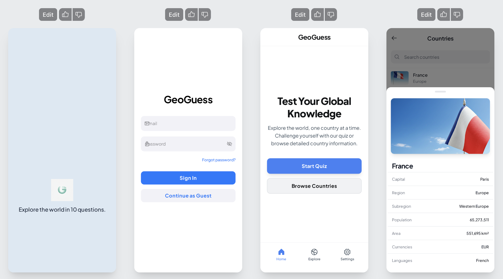
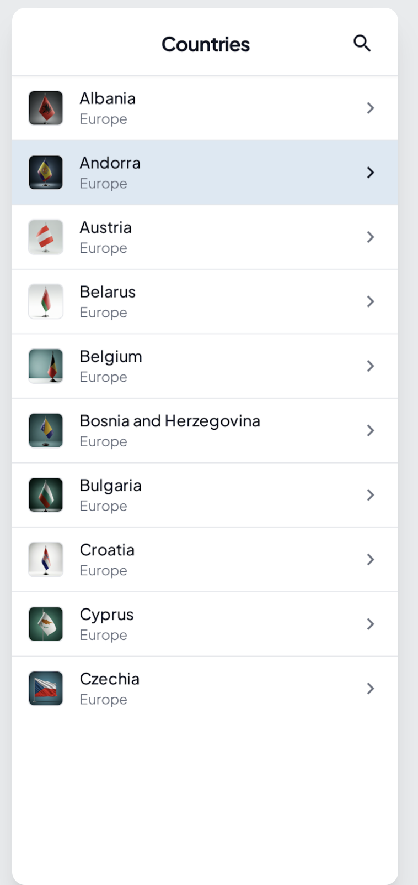
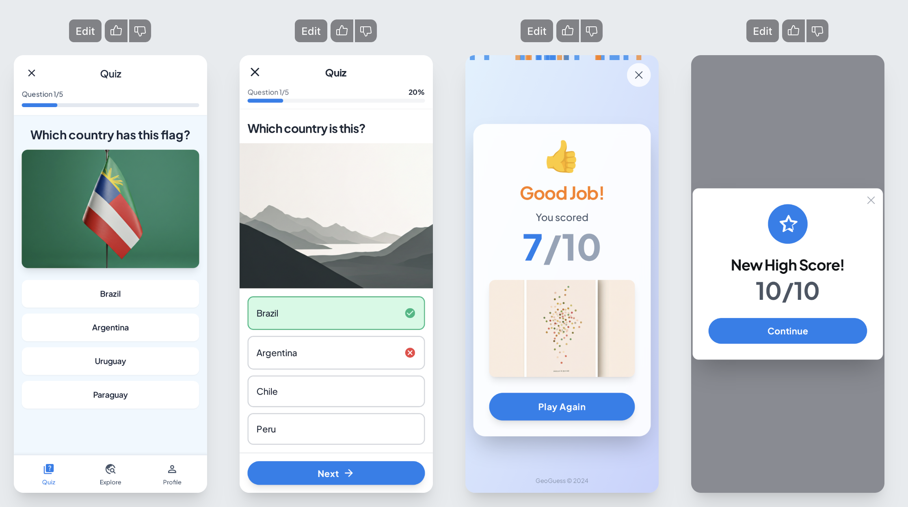

# GeoGuess 🌍

A professional iOS application built to demonstrate a modern, scalable, and testable architecture. GeoGuess is an educational quiz and information app that allows users to test their knowledge of world countries and browse a catalog of country details.

## Project Description

The app is built using a robust set of modern iOS development patterns and frameworks to ensure separation of concerns, testability, and a reactive user experience.

### Architecture Overview

-   **MVVM (Model-View-ViewModel)**: At the core of each module, the MVVM pattern is used to separate the UI (View) from the business logic and state (ViewModel). This separation allows for independent development and testing of the app's logic without relying on the UI.

-   **Coordinator Pattern**: Navigation logic is fully decoupled from View Controllers. Coordinators are responsible for managing the application's flow, creating and presenting view controllers, and passing dependencies. This makes the navigation logic centralized and easy to follow.

-   **Combine Framework**: Combine is used extensively for reactive programming. It powers the bindings between Views and ViewModels, ensuring that the UI automatically updates when the underlying data changes. It is also used in the `NetworkMonitor` to reactively publish the device's connectivity status.

-   **Modular Network Layer**: The networking stack is designed to be type-safe and generic. It uses a custom `URLRequestBuilder` to construct requests from an `Endpoint` definition, which are then executed by a generic `NetworkManager`. This isolates all networking logic and makes adding new API calls simple and clean.

-   **Offline Support with SwiftData**: The app provides a seamless offline experience by caching all country data locally using SwiftData. When the `NetworkMonitor` detects a lost connection, the app automatically falls back to the local cache, allowing users to continue browsing country information.

## Project Structure

The project is organized with clear separation of responsibilities between folders.

```
GeoGuess/
├── Resources/            // Assets.xcassets, Localizable.strings
├── Root/                 // AppDelegate, SceneDelegate
├── Sources/
│   ├── Base/             // BaseViewController, Extensions, and Design System components
│   ├── Coordinators/     // AppCoordinator, MainCoordinator, and other navigation coordinators
│   ├── Modules/          // Feature modules (e.g., Authorization, Home, List, Quiz)
│   ├── NetworkModels/    // Data Transfer Objects (DTOs) for API responses
│   ├── Services/         // Core services (Networking, Caching, Authorization)
│   └── Utilities/        // Validator
├── SupportingFiles/      // Info.plist
Tests/                // Unit tests
```

## Metrics Table

The following table outlines key quality metrics achieved in the project.

| Metric                 | Description                                    | Value |
| ---------------------- | ---------------------------------------------- | :---: |
| **Architecture**       | MVVM + Coordinator                             |   ✅   |
| **Networking**         | Modular, typed, generic                        |   ✅   |
| **Offline Support**    | SwiftData caching with reactive fallback       |   ✅   |
| **Combine Usage**      | ViewModel bindings, network monitor            |   ✅   |
| **Unit Tests**         | Mocked services                                |   ✅   |
| **Test Coverage**      | `CountriesListViewModel`, `Validator`          |   ✅   |
| **Dependency Injection** | Via initializers (non-singleton approach)    |   ✅   |

## AI Interaction

This project was developed in a pair-programming style with an AI assistant. The AI was used as a tool to accelerate development, research development. 

### Design with Stitch AI

For some design tasks and UI prototyping, Stitch AI (from Google) was used. Stitch AI is helpful for generating quick design overviews and ideas, but it currently cannot ensure consistent or production-ready design (for example, it may generate screens with an unequal number of tabs or inconsistent layouts). It is best used for inspiration and rapid prototyping, not for final UI assets or flows.





Example:


## Prompts Used

The development process was guided by a series of high-level prompts. The following are representative examples of the instructions given to the AI assistant during the project:

-   *"Add offline support using SwiftData and a reactive NetworkMonitor."*
-   *"Refactor the entire project to centralize all UI constants, colors, and strings."*
-   *"Implement the end-to-end quiz flow using the existing coordinator pattern."*
-   *"Refactor the validation logic from the view model into a separate, testable Validator class and write unit tests for it."*
-   *"You are an expert technical writer. Write a professional README.md for this project."*

## 📊 AI Development Metrics

This section provides an analysis of the AI-assisted development process for this project.

| Metric                                 | Description                                                                              | Estimated Value         |
| -------------------------------------- | ---------------------------------------------------------------------------------------- | ----------------------- |
| ⏳ **Time without AI (hours)**         | A rough estimate of the time this project would take a solo developer with similar experience. | ~20 hours               |
| 🕒 **Actual time with AI (hours)**     | The total wall-clock time spent on the project from start to finish.                     | ~16 hours               |
| 🤖 **Time working with AI (hours)**    | The time spent specifically on writing prompts, reviewing AI output, and guiding the AI.  | ~6 hours                |
| 🧩 **AI Assistants Used**              | The primary AI development environment used for this project.                            | ChatGPT, Cursor (for READ.me and Unit-testing) and Stitch AI (desingning) |

### 💬 Top 3 Successful Prompts

1.  **Refactor Validation Logic - ChatGPT:**
    *   **Prompt:** *"Okay, for you it's hard, just move validate function (from auth screen) to validator class and test it."*
    *   **Why it worked:** This was a perfectly scoped task. It asked the AI to perform a clear extraction refactoring and then write corresponding unit tests. The AI understood the goal, located the code, performed the refactoring, and wrote high-quality tests with minimal friction.

2.  **Decomposing the Network Layer:**
    *   **Prompt:** *"Refactor the network layer to decompose NetworkManager into several layers: a ResponseHandler for parsing and error handling, a generic NetworkManager for request execution, and a URLBuilder for constructing requests from endpoints."*
    *   **Why it worked:** The AI successfully split the networking logic into clear, modular components, improving testability and maintainability. The resulting architecture made it easier to add new endpoints and handle errors consistently.

3.  **Centralizing Constants in an Enum:**
    *   **Prompt:** *"Collect all constants used throughout the project (layout, colors, strings, etc.) into a single enum for better maintainability and consistency."*
    *   **Why it worked:** The AI gathered most constants into a centralized enum, improving code organization and maintainability. However, it did not automatically find every constant, so some manual review and consolidation was still required.

4.  **Generating the README:**
    *   **Prompt:** *"You are an expert technical writer. Write a professional README.md for an iOS app project, including architecture, features, and development process."*
    *   **Why it worked:** The AI produced a comprehensive, well-structured README in a fraction of the time it would take manually, covering all key aspects of the project.

5.  **Generating the Project Idea:**
    *   **Prompt:** *"Provide the top 10 free APIs and suggest an app idea based on them."*
    *   **Why it worked:** The AI suggested several free APIs and generated the initial concept for the app, accelerating the ideation and planning phase.

### 🧠 Reflection

- **ChatGPT:** Excellent at gathering and explaining information (e.g., providing overviews of technologies like SwiftData, describing what is used under the hood, or giving concise topic summaries). It writes high-quality explanatory text and documentation. However, it is not strong at code generation for large or complex projects: it often loses the context of the project and the ongoing dialog, may loop on broken fixes, and frequently produces low-quality or monolithic code (e.g., combining unrelated responsibilities in a single class or function). When creating components, it tends to ignore separation of concerns. Not suitable for context-aware, high-quality code generation in a real project.

- **Cursor:** Has a good understanding of the project context and can accurately describe or summarize the codebase. It is effective for project-wide refactoring and documentation. However, it is not integrated with Xcode, which limits its utility for some iOS workflows. Occasionally, it may lose track of file locations (e.g., placing tests in the wrong folder) or duplicate files when generating new code.

- **Stitch AI:** Helpful for quick UI prototyping and generating design ideas. Useful for visual inspiration and layout suggestions, but not suitable for producing consistent or production-ready designs.

-   **What went well:** The AI assistant excelled at scaffolding new components (`Validator`, `ImageCache`), refactoring isolated logic, writing simple unit tests and generating structured text like the `README`. Its ability to instantly "read" a file and understand its context was a massive time-saver.

-   **What could be improved:** The process of applying large, complex edits to existing files can be brittle. The AI sometimes got stuck in a loop of incorrect fixes, requiring manual intervention or a more forceful "overwrite" approach. This indicates that human oversight is most critical during significant architectural refactoring.

-   **Conclusion:** Using an AI assistant like ChatGPT, Cursor, etc. is a powerful force multiplier. It dramatically reduces the time spent on boilerplate and research. For well-defined, scoped tasks, it's an unparalleled productivity tool. However, AI-generated code may not always account for future extensibility or best practices. For example, when generating a base coordinator, the AI did not implement a childCoordinators array, which is essential for retaining child coordinators in memory and ensuring proper navigation flows. Manual review and refactoring are recommended to ensure long-term maintainability and scalability.

**Demo Materials:**
- [Video Demo](Demo/Video.mp4) - Complete app demonstration

## Improvements

- **Image Storage:** Currently, image URLs are stored in SwiftData. This is not optimal for offline or performance-critical scenarios. A better approach would be to download and store images locally using FileManager, and persist only the file paths or identifiers in the database.
- **Time Constraints:** Due to limited time, a full-scale refactor of the entire codebase was not possible. Some architectural or technical debt remains.
- **Quiz Feature Refactoring:** The entire Quiz feature block requires refactoring for consistency with the rest of the codebase. Due to time constraints (approximately 16 hours), the refactoring of this feature was not completed.

